# 🌍 AI Personalized Trip Planner

A comprehensive "Travel Super App" powered by **LangGraph** and **Streamlit**. This application uses a multi-agent AI system to plan your perfect trip, orchestrating 8 specialized agents to handle everything from itinerary creation to safety alerts and packing lists.

## ✨ Features

### 1. 🤖 Intelligent Itinerary Builder
- **What it does**: Generates a detailed day-by-day travel plan including morning, afternoon, and evening activities.
- **Powered by**: OpenAI GPT-5 (customizable).

### 2. 🗺️ Interactive Map Visualization
- **What it does**: Automatically extracts key locations (landmarks, hotels, attractions) from your itinerary and plots them on an interactive map.
- **Tech**: `geopy` for geocoding + Streamlit Map.

### 3. 🎟️ Live Event Scout
- **What it does**: Searches the web for real-time concerts, festivals, sports events, and local happenings that coincide strictly with your travel dates.
- **Powered by**: Tavily Search API.

### 4. 💰 Budget Auditor
- **What it does**: Reviews your generated itinerary to identify potential budget risks (e.g., "This restaurant is widely known to be overpriced").

### 5. 🎒 Smart Packing Assistant
- **What it does**: Generates a dynamic packing checklist based on:
    - **Destination Weather**: Inferred context.
    - **Activities**: Hiking gear for hikes, formal wear for operas, etc.
    - **Duration**: Quantities adjusted for trip length.

### 6. ✈️ Flight Search & Logistics
- **What it does**: Finds real flight options from your origin to destination using Tavily Search.

### 7. 💎 Local Hidden Gems
- **What it does**: Suggests off-the-beaten-path locations that standard travel guides might miss.

---

## 🏗️ Architecture

This project implements a **Fan-Out / Fan-In** architecture using **LangGraph**.

### The Workflow

```mermaid
%%{init: {'theme': 'base', 'themeVariables': { 'primaryColor': '#e1f5fe', 'edgeLabelBackground':'#ffffff', 'tertiaryColor': '#f1f8e9'}, 'flowchart': {'curve': 'basis'}}}%%
graph TD
    %% --- LAYER 1: FRONTEND INPUT ---
    Start([User Opens App]) --> Input[/User Input: Destination, Dates, Interests/]
    
    %% --- LAYER 2: ORCHESTRATOR START ---
    Input --> Builder[🤖 Itinerary Builder Node]

    %% --- LAYER 3: PARALLEL AGENTS (Fan-Out) ---
    subgraph FanOut [Parallel Execution Swarm]
        direction TB
        Builder -- "Broadcast Plan" --> Map[🗺️ Mapping Agent]
        Builder --> Event[🎟️ Event Scout]
        Builder --> Pack[🎒 Packing Agent]
        Builder --> Budget[💰 Budget Auditor]
        Builder --> Tips[💎 Hidden Gems]
        Builder --> Flight[✈️ Flight Agent]
        Builder --> Alert[🚨 Alert Agent]
    end

    %% --- LAYER 4: AGGREGATION (Fan-In) ---
    Map --> Summary[📝 Summary Compiler]
    Event --> Summary
    Pack --> Summary
    Budget --> Summary
    Tips --> Summary
    Flight --> Summary
    Alert --> Summary

    %% --- LAYER 5: FRONTEND OUTPUT ---
    Summary --> Display[/Final Dashboard: Itinerary + Maps + Lists/]
    Display --> End([End])

    %% Styling
    classDef parallel fill:#fff9c4,stroke:#fbc02d,color:#000000;
    class Map,Event,Pack,Budget,Tips,Flight,Alert parallel;
    
    classDef core fill:#bbdefb,stroke:#1565c0,color:#000000;
    class Builder,Summary core;
    
    classDef ui fill:#e8eaf6,stroke:#3f51b5,stroke-width:2px,color:#000000;
    class Start,Input,Display,End ui;
```


1.  **Input**: User provides Destination, Origin, Dates, and Interests.
2.  **Itinerary Builder (Start)**: The core LLM agent generates the base plan.
3.  **Fan-Out (Parallel Execution)**: Once the itinerary is ready, the state is passed simultaneously to specialized agents:
    - `mapping_agent`: Extracts & geocodes locations.
    - `event_agent`: Searches for live events.
    - `packing_agent`: Creates a packing list.
    - `budget_agent`: Audits costs.
    - `suggestion_agent`: Finds hidden gems.
    - `flight_agent`: Searches flights.
    - `alert_agent`: Checks for safety/weather alerts.
4.  **Fan-In (Aggregation)**: All parallel outputs are aggregated.
5.  **Summary Node**: Compiles a final Markdown report incorporating all insights.
6.  **UI Display**: Streamlit renders the structured data into Tabs (Plan, Map, Events, Logistics).

### 📂 File Structure
- `app/graph.py`: Defines the StateGraph, nodes, and edges.
- `app/agents.py`: Contains the logic/functions for all 8 agents.
- `app/state.py`: Defines the `AgentState` schema (TypedDict).
- `gui.py`: The Streamlit frontend application.
- `main.py`: Simple entry point (optional).

---

## 🛠️ Setup & Installation

**1. Clone & Environment**
```bash
git clone <repo-url>
cd Personalized-Trip-Planner
python -m venv venv
# Windows
venv\Scripts\activate
# Mac/Linux
source venv/bin/activate
```

**2. Install Dependencies**
```bash
pip install -r requirements.txt
```

**3. Configure API Keys**
Create a `.env` file in the root directory:
```env
OPENAI_API_KEY=sk-...
TAVILY_API_KEY=tvly-...
```

**4. Run the Application**
```bash
streamlit run gui.py
```
This will launch the web interface in your browser (usually `http://localhost:8501`).

---

## 🤖 Tech Stack
- **Orchestration**: LangChain & LangGraph
- **LLM**: OpenAI GPT models
- **Search**: Tavily API
- **Frontend**: Streamlit
- **Geocoding**: Geopy
